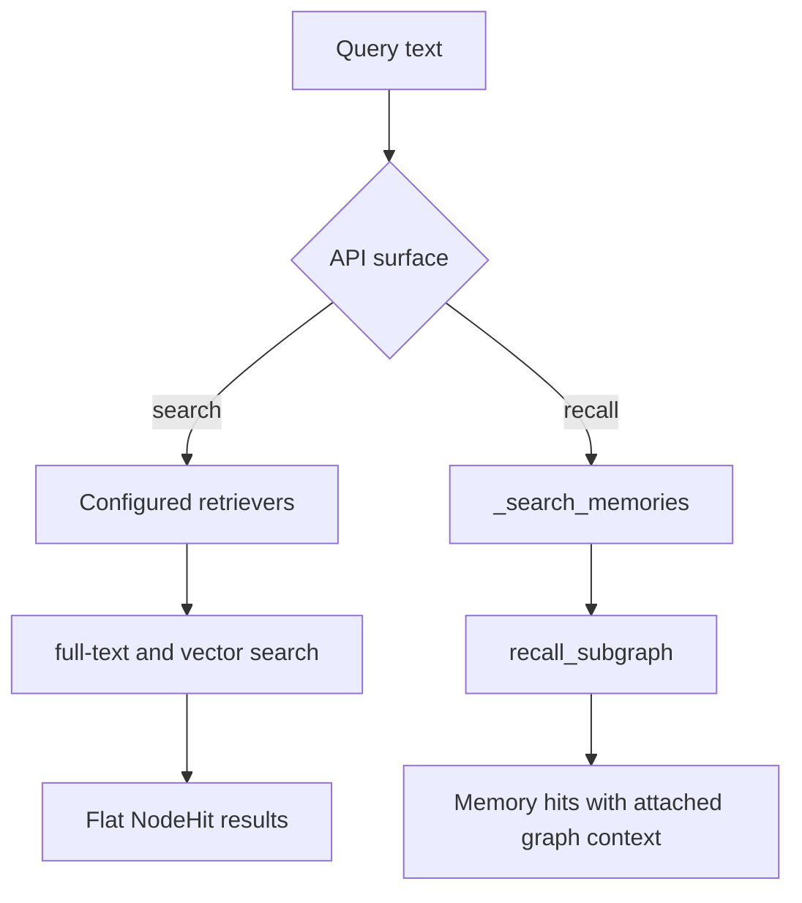

# Flows

The public API centers on the `GraphRAG` facade in
`src/grawiki/rag/graph_rag.py`.

## Document ingestion

`GraphRAG.ingest(path)` is the main end-to-end ingestion flow. It reads a file, creates chunks, optionally applies configured post-chunk processors, persists document and chunk nodes, extracts a chunk-level knowledge graph, optionally resolves extracted entities against persisted ones, and writes the resulting graph state to the database.

Format routing is content-driven:

- `read_document(...)` labels `.md` and `.markdown` files as markdown content.
- `read_document(...)` converts `.pdf` files to markdown in memory, then marks them as markdown content too.
- `chunk_document(...)` uses `document.metadata["content_format"]` unless an explicit `format=` override is passed.
- `ingest_text(...)` chooses the same shared ingestion flow, but callers must explicitly pass `format="markdown"` for in-memory markdown.

Plain text always stays on the generic text chunker. Markdown content uses that same chunker by default and only switches to the markdown pipeline when `markdown_pipeline=` is configured on `GraphRAG(...)`.

When `chunk_processors=` are configured on `GraphRAG(...)`, the resulting chunks pass through `process_chunks(...)` after chunking and before chunk embedding or extraction.

```mermaid
flowchart TD
    A[Source file path] --> B[self._db.setup]
    B --> C[read_document]
    C --> D[chunk_document by content_format]
    D --> E[process_chunks optional processors]
    D --> F[embed_document returns []]
    E --> G[embed_chunks]
    F --> H[build_document_node]
    G --> I[build_chunk_nodes]
    H --> J[persist_document_and_chunks]
    I --> J
    J --> K[extract_kg_per_chunk]
    K --> L{resolve_entities_on_ingest?}
    L -- yes --> M[_resolve_extracted_entities]
    L -- no --> N[persist_entities_and_relationships]
    M --> N
    N --> O[(Graph state updated)]
```

The same steps are also available as public methods. That makes the pipeline easier to inspect in notebooks and debugging sessions, including the post-chunk `process_chunks(...)` stage. In the default ingestion path, chunk embeddings drive vector retrieval; document nodes are persisted without document-level vectors unless you intentionally add them later. `ingest(...)` and `ingest_text(...)` both delegate to the same internal ingest implementation once the document content format is known. The maintained notebook workflow, and the corresponding [How to](how-to/index.md) guides, use these methods directly instead of relying only on the one-shot `ingest(...)` wrapper.

## Memory and retrieval

GraWiki also exposes a second set of flows for memory and search:

- `remember(...)` persists a `__memory__` node, embeds the memory text, extracts
  entities from the memory body, and persists those links back into the graph.
- `search(...)` runs the configured retrievers and returns flat `NodeHit`
  results.
- `recall(...)` searches only memory nodes first, then expands connected graph
  context around those memory hits.



Together, these flows make GraWiki both a graph-extraction pipeline and a memory-oriented retrieval layer.
