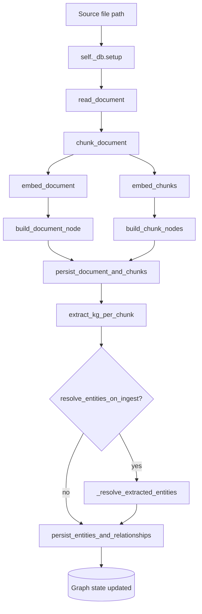
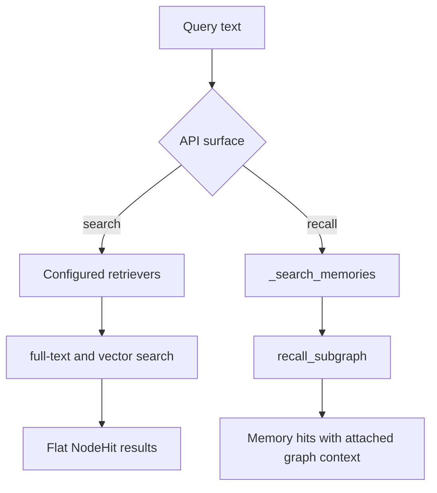

# Flows

The public API centers on the `GraphRAG` facade in
`src/grawiki/rag/graph_rag.py`.

## Document ingestion

`GraphRAG.ingest(path)` exposes the clearest end-to-end flow in the repository.
It reads a file, creates chunk and document nodes, extracts a chunk-level
knowledge graph, optionally resolves extracted entities against already
persisted ones, and then writes the resulting graph state to the database.

The explicit stepwise methods also exist as public methods, which makes the
pipeline easier to inspect in notebooks and debugging sessions. The repository's
numbered tutorial notebooks use these step methods directly rather than relying
only on the one-shot `ingest(...)` wrapper.

## Memory and retrieval

GraWiki also exposes a second family of flows around memory and search:

- `remember(...)` persists a `__memory__` node, embeds the memory text, extracts
  entities from the memory body, and persists those links back into the graph.
- `search(...)` runs the configured retrievers and returns flat `NodeHit`
  results.
- `recall(...)` searches only memory nodes first, then expands connected graph
  context around those memory hits.

Together, these flows let GraWiki act as both a graph-extraction pipeline and a
memory-oriented retrieval layer.
