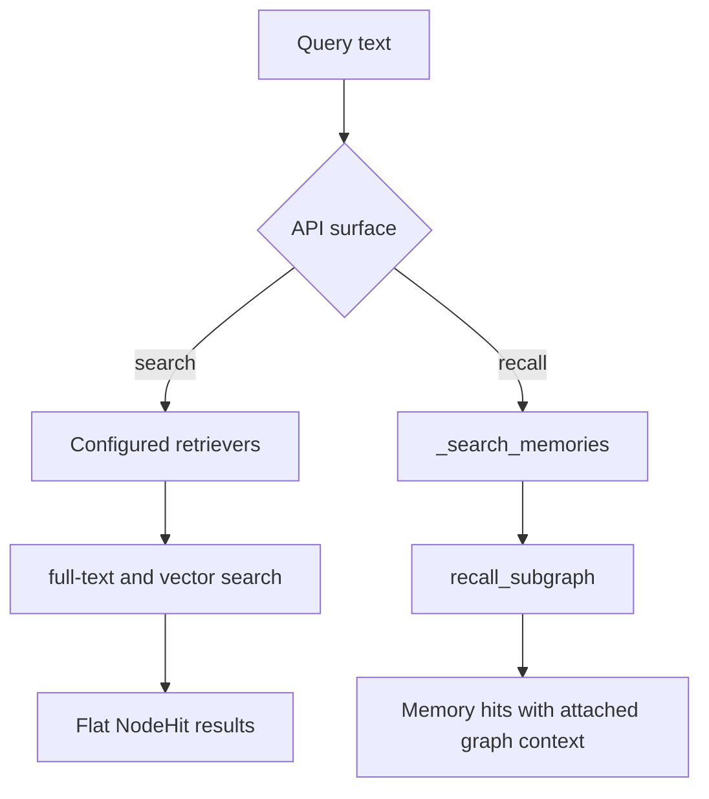

# Flows

The public API centers on the `GraphRAG` facade in
`src/grawiki/rag/graph_rag.py`.

## Document ingestion

`GraphRAG.ingest(path)` is the main end-to-end ingestion flow. It reads a file, creates document and chunk nodes, extracts a chunk-level knowledge graph, optionally resolves extracted entities against persisted ones, and writes the resulting graph state to the database.

If a `markdown_chunker` is configured, `.md` and `.markdown` files are segmented with Markdown-aware chunking so text, code, and table regions become ordered chunks. The same markdown-aware path is also used by `ingest_text(...)` when you ingest markdown already held in memory.

```mermaid
flowchart TD
    A[Source file path] --> B[self._db.setup]
    B --> C[read_document]
    C --> D[chunk_document]
    D --> E[embed_document returns []]
    D --> F[embed_chunks]
    E --> G[build_document_node]
    F --> H[build_chunk_nodes]
    G --> I[persist_document_and_chunks]
    H --> I
    I --> J[extract_kg_per_chunk]
    J --> K{resolve_entities_on_ingest?}
    K -- yes --> L[_resolve_extracted_entities]
    K -- no --> M[persist_entities_and_relationships]
    L --> M
    M --> N[(Graph state updated)]
```

The same steps are also available as public methods. That makes the pipeline easier to inspect in notebooks and debugging sessions. In the default ingestion path, chunk embeddings drive vector retrieval; document nodes are persisted without document-level vectors unless you intentionally add them later. The maintained notebook workflow, and the corresponding [How to](how-to/index.md) guides, use these methods directly instead of relying only on the one-shot `ingest(...)` wrapper.

## Memory and retrieval

GraWiki also exposes a second set of flows for memory and search:

- `remember(...)` persists a `__memory__` node, embeds the memory text, extracts
  entities from the memory body, and persists those links back into the graph.
- `search(...)` runs the configured retrievers and returns flat `NodeHit`
  results.
- `recall(...)` searches only memory nodes first, then expands connected graph
  context around those memory hits.



Together, these flows make GraWiki both a graph-extraction pipeline and a memory-oriented retrieval layer.
