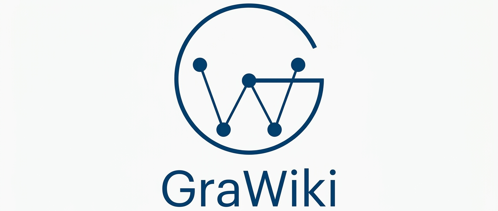

# Project Structure

{ width="360" }

This page summarizes the public repository layout and the main package surfaces exposed by GraWiki.

## Top-level folders

### `src/grawiki/`

Main application package. This is where the reusable project code lives.

### `tests/`

Pytest coverage for `GraphRAG`, the modular ingestion-step API, the retrieval layer, graph models and extraction, Cypher query generation, and the FalkorDB adapter.

### `docs/`

Official public MkDocs documentation source. This includes both narrative pages and generated API reference pages under `docs/api/`, with `GraphRAG` as the main entry point.

### `agent_tools/`

Internal contributor and agent-facing guidance, plans, and repository maps. `agent_tools/CODEMAP.md` is the most complete orientation guide for contributors.

### `notebooks/`

Maintained tutorial notebooks plus supporting debug scripts and sample data.
The main walkthrough now starts in `01_ingest_and_deduplicate.ipynb`, then continues into agent memory (notebook 02 - `02_agent_memory_and_recall.ipynb`) and visualization (notebook 03 - `03_visualize_graph.ipynb`).

## Important top-level files

- `README.md`: repository overview and setup commands.
- `mkdocs.yml`: public documentation site configuration.
- `.readthedocs.yaml`: Read the Docs build configuration.
- `pyproject.toml`: package metadata, dependencies, and tool configuration.
- `main.py`: minimal placeholder entrypoint.
- `AGENTS.md`: repository-specific operating instructions for coding agents.

## Package map

### `grawiki`

Top-level package that re-exports [`GraphRAG`][grawiki.rag.graph_rag.GraphRAG], the main public facade.

### `grawiki.core`

Shared source-data models and embedding abstractions.

- `core/commons.py`: lightweight pre-persistence `Document` and `Chunk` models.
- `core/embedding.py`: the shared `Embedding` protocol used across ingestion, extraction, retrieval, and similarity workflows.

### `grawiki.doc_processing`

Document loading and chunking utilities.

- `doc_processing/document_processing.py`: source document reading and chunking entry helpers.
- `doc_processing/chunkers.py`: strategy wrapper around `chonkie` for `fast`, `recursive`, `semantic`, `sentence`, and `token` chunking.

### `grawiki.graph`

Knowledge-graph-specific schema, prompts, and extraction logic.

- `graph/models.py`: canonical persisted graph schema including `Node`, `Relationship`, `KnowledgeGraph`, `DocumentNode`, `ChunkNode`, and `MemoryNode`.
- `graph/prompts.py`: the extraction prompt template.
- `graph/extraction.py`: `KnowledgeGraphExtractor` and the extractor-facing transient graph shapes.

### `grawiki.db`

Database abstraction layer and FalkorDB implementation.

- `db/base.py`: the `GraphDB` contract plus shared hit/result models.
- `db/cypher.py`: Cypher query builders.
- `db/falkordb.py`: the `FalkorGraphDB` backend used by the project today.

### `grawiki.retrieval`

Query-time retrieval strategy layer.

- `retrieval/base.py`: the `Retriever` protocol.
- `retrieval/text.py`: full-text and vector retrieval over stored nodes.
- `retrieval/keywords.py`: keyword extraction plus graph-context expansion.

### `grawiki.similarity`

Entity similarity inspection and deduplication support.

- `similarity/base.py`: the `EntitySimilarityMatcher` protocol.
- `similarity/vector.py`: embedding-based entity matching.
- `similarity/fuzzy.py`: RapidFuzz-based name matching.
- `similarity/similarity_finder.py`: duplicate-candidate orchestration.
- `similarity/deduplication.py`: merge helper logic and `MergeReport`.

### `grawiki.rag`

High-level RAG facade.

- `rag/graph_rag.py`: the main end-to-end ingestion, search, memory, and deduplication entrypoint.

## How the pieces fit together

1. `grawiki.rag.GraphRAG` orchestrates the user-facing flows.
2. `grawiki.doc_processing` reads and chunks source material.
3. `grawiki.graph.extraction` turns chunk text into graph structure.
4. `grawiki.db` persists nodes, relationships, memories, and search indexes.
5. `grawiki.retrieval` handles query-time embedding and graph-context retrieval.
6. `grawiki.similarity` powers duplicate inspection, ingest-time entity resolution, and deduplication.
